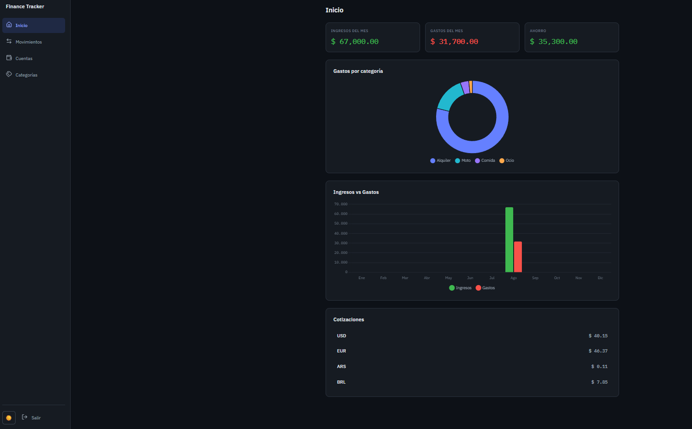
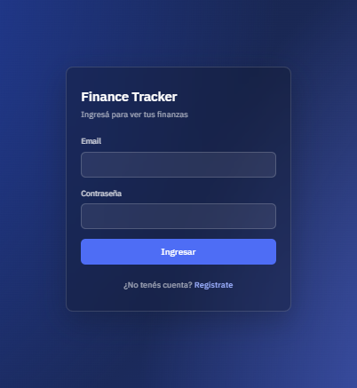
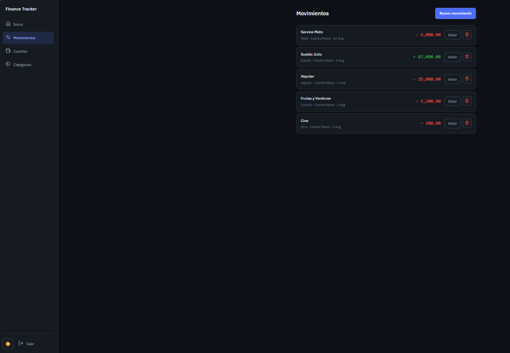

# Finance Tracker

Aplicación full-stack de finanzas personales pensada para el contexto uruguayo, donde es habitual manejar pesos y dólares al mismo tiempo.

Permite registrar ingresos y gastos en varias cuentas y monedas, y ver todo consolidado en un único panel — con los montos convertidos usando la cotización vigente **en la fecha de cada movimiento*.

>Este proyecto se desarrolló con Claude como mentor técnico: explicaba conceptos,
> señalaba riesgos de seguridad y proponía alternativas.
> La decisión de diseño y el código, fue escrito por mí — Claude no generó
> commits ni tocó el repositorio directamente (con la excepción puntual de la
> suite de tests, hecha con Claude Code y revisada antes de integrarla).

> **Estado:** en desarrollo activo. El núcleo está completo y funcionando (autenticación, cuentas, categorías, movimientos, reportes y dashboard), con cobertura de tests en backend y frontend. Ver [Roadmap](#roadmap) para lo que sigue.

---

## Capturas



| Login | Movimientos |
|---|---|
|  |  |

<!-- TODO: agregar el link a la demo cuando esté desplegada -->
<!-- **Demo en vivo:** https://... -->

---

## Funcionalidades

**Registro de movimientos**
- Múltiples cuentas, cada una con su propia moneda
- Ingresos y gastos con **actualización atómica del saldo**: el movimiento y el balance de la cuenta se escriben dentro de una misma transacción de base de datos, con rollback si algo falla
- Categorías propias, tipadas como ingreso o gasto

**Multi-moneda**
- Cotizaciones obtenida de API externa
- Los reportes convierten cada monto a una sola moneda usando **la cotización más cercana anterior o igual a la fecha del movimiento**
  
**Panel de reportes**
- Resumen mensual: ingresos, gastos y ahorro neto
- Gastos por categoría (gráfico de dona)
- Ingresos vs. gastos (gráfico de barras)
- Cotizaciones del día

**Interfaz**
- Responsive, mobile-first: barra inferior en móvil, sidebar en escritorio
- Tema oscuro por defecto, con cambio a tema claro

---

## Stack

**Backend**
- .NET 10 (Web API)
- SQL Server 2025
- Entity Framework Core — enfoque database-first
- Autenticación JWT (`Microsoft.AspNetCore.Authentication.JwtBearer`)
- BCrypt para el hash de contraseñas

**Frontend**
- Angular 22 
- SCSS 
- Chart.js 4 
- Lucide para los íconos

**Tests**
- Backend: xUnit + Moq + EF Core InMemory — unitarios de servicios e integración con `WebApplicationFactory`
- Frontend: Vitest — componentes clave, interceptor y guard de autenticación

**APIs externas**
- [Frankfurter](https://frankfurter.dev) — cotizaciones de referencia del BCE, base USD
- [UruguayAPI](https://github.com/AFornio/UruguayAPI) — cotizaciones del BROU, base UYU

---

## Arquitectura

En capas, con interfaces en cada límite:

```
Controller  →  Service  →  Repository  →  DbContext  →  SQL Server

```

```
FinanceTracker/
├── FinanceTracker.API/          # Web API en .NET 10
│   ├── Controllers/             # endpoints HTTP, livianos
│   ├── Services/                # reglas de negocio y validación
│   ├── Repositories/            # acceso a datos
│   ├── DTOs/                    # contratos separados de entrada y salida
│   ├── Models/                  # entidades de EF Core (scaffolded)
│   ├── Exceptions/              # excepciones tipadas (Conflict, Unauthorized)
│   ├── Middlewares/             # manejo global de excepciones
│   └── Data/                    # DbContext
│
├── FinanceTracker.API.Tests/    # xUnit + Moq + EF InMemory
│   ├── Services/                # tests unitarios por servicio
│   └── Integration/             # tests de extremo a extremo por controller
│
├── FinanceTracker.Web/          # SPA en Angular 22
│   └── src/app/
│       ├── core/                # servicios, guards, interceptors, modelos
│       ├── features/            # auth, dashboard, cuentas, categorías, movimientos
│       ├── layout/              # sidebar, barra inferior, layout principal
│       └── shared/              # componentes reutilizables (modal, theme toggle)
│
├── docs/                        # capturas usadas en este README
└── database/                    # scripts de creación del esquema
```

## Seguridad

- Los secretos viven en `appsettings.Development.json`, que está en el `.gitignore`. El `appsettings.json` versionado no contiene cadena de conexión ni clave de firma.
- Contraseñas hasheadas con BCrypt.
- Los fallos de login devuelven un mensaje deliberadamente ambiguo (idéntico si el email no existe o si la contraseña es incorrecta), para que el endpoint no sirva para enumerar qué direcciones de email están registradas.
- Excepciones tipadas (`ConflictException`, `UnauthorizedException`) mapeadas a sus status HTTP correctos (409, 401) en un único middleware — ningún stack trace llega al cliente.
- El CORS está restringido a un origen específico; no se usa `AllowAnyOrigin`.
- Los guards de rutas del frontend son solo una comodidad de UX. La autorización real se aplica del lado del servidor con `[Authorize]` y acotando cada consulta al id de usuario que viene en el token.

---

## Roadmap

**Deudas conocidas**
- No hay refresh tokens: las sesiones expiran a los 60 minutos.
- Todavía no está desplegado; corre localmente.
- `AuthService` y `ExchangeRateService` acceden al `DbContext` directamente, sin pasar por un Repository, a diferencia del resto de los módulos.
- Algunos specs de Angular generados por el CLI (layout, modal, gráficos) tienen fallas preexistentes no relacionadas con la lógica de negocio.

**Planeado**
- Movimientos recurrentes (sueldo, alquiler)
- Metas de ahorro con cálculo automático del aporte necesario por período
- Presupuestos con alertas de ritmo de gasto
- Gastos compartidos (dividir la cuenta)
- Congelar la cotización en cada movimiento al momento de guardarlo
- Migrar el almacenamiento del JWT a una cookie
- Verificación de email en el registro
- Tabla de auditoría con el historial completo de cambios
---

## Autor

Desarrollado por **Franco Canestrini** — desarrollador full-stack en Uruguay.

Trabajo con .NET, Angular, Vue y SQL Server.
